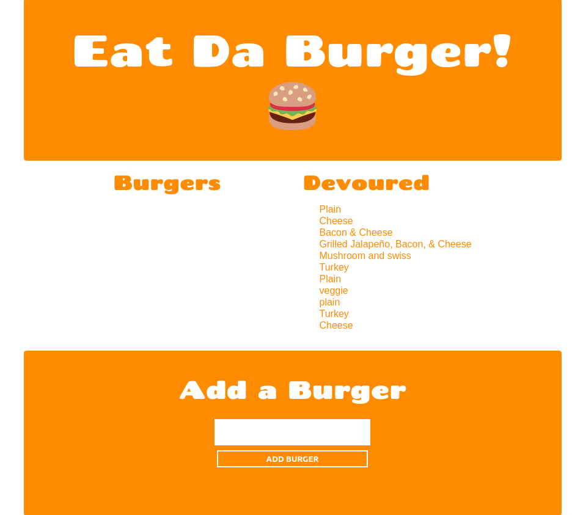

# 13_Eat_Da_Burger

A simple CRUD app that takes the name from a user and adds it to a list. The "burger" can then be "devoured" and will show up on the "devoured" list.

[Deployed App](peaceful-inlet-93418.herokuapp.com/)

## Table of contents

- [Usage](#usage)
- [License](#license)
- [Contributions](#contributions)
- [Tests](#tests)
- [Questions](#Questions)

## Screenshot

## License

## Contributions

Please email regarding any contributions.

## Tests

Currently, there are no tests.

## Questions

For any questions, please email <gregstead@gmail.com>
Or [visit my github](https://github.com/gregstead/)
